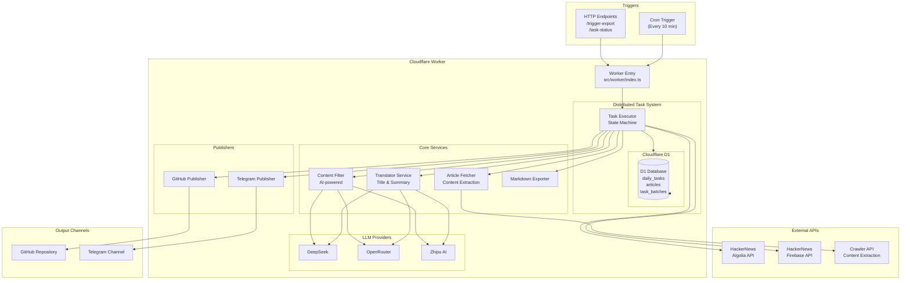
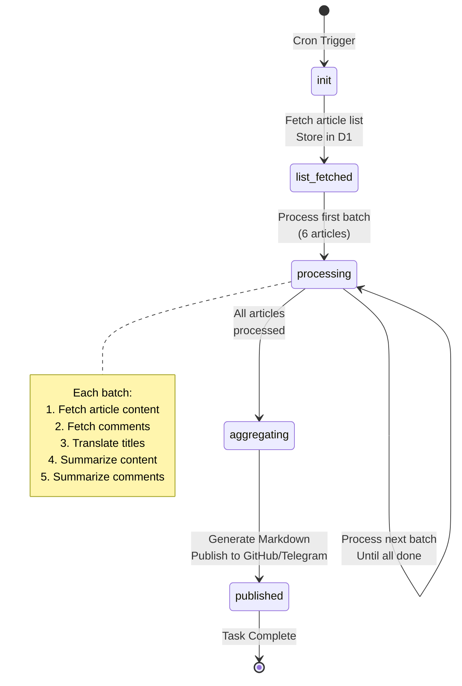
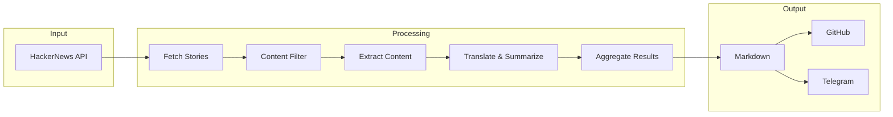

# HackerNews Daily - Chinese Translation

A Cloudflare Worker that fetches top-rated stories from HackerNews's curated "best" list, processes them incrementally using D1 database for state management, extracts full article content via Crawler API, generates AI-powered summaries, fetches and summarizes top comments, and translates everything to Chinese using configurable LLM providers. Supports publishing to GitHub and Telegram.

## Key Features

- **Distributed Processing**: Uses Cloudflare D1 database to manage task state across multiple cron triggers
- **Incremental Execution**: Processes articles in batches (default 6 per trigger) to stay within free tier subrequest limits (50/execution)
- **State Machine Architecture**: Tracks task status through transitions: init → list_fetched → processing → aggregating → published
- **Resilient**: Idempotent operations support safe retries and recovery from failures

## System Architecture



### State Machine Flow



### Data Flow



## Documentation

Comprehensive documentation is available in the `docs/` directory:

### Quick Start
- **[Quick Start Guide](docs/quick-start.md)** - Get up and running in 5 minutes

### Configuration
- **[Configuration Guide](docs/configuration.md)** - Complete configuration reference
  - D1 database settings
  - Task processing options
  - LLM provider setup
  - Story fetching and content processing
  - GitHub/Telegram publishing configuration
  - Cron scheduling and performance tuning

### API Reference
- **[API Endpoints](docs/api-endpoints.md)** - HTTP API documentation
  - Health check (`GET /`)
  - Trigger export (async) and (sync)
  - Task status (`GET /task-status`)
  - Retry failed tasks (`POST /retry-failed-tasks`)
  - Force publish (`POST /force-publish`)
  - Error handling and rate limiting

### Deployment
- **[Cloudflare Worker Deployment](docs/cloudflare-worker-deployment.md)** - Production deployment
  - Wrangler CLI setup
  - Environment variable configuration
  - Secret management

### Database Management
- **[D1 Database Management](docs/d1-database-management.md)** - Database operations
  - Two-database strategy (production/dev)
  - Schema reference
  - Common queries
  - Performance monitoring
  - Backup and maintenance

### Development
- **[Local Development Guide](docs/local-development.md)** - Local testing and debugging
  - Development environment setup
  - Database isolation for safe testing
  - Testing HTTP endpoints
  - Debugging techniques and tools

### Monitoring & Logging
- **[Logging Guide](docs/logging.md)** - Observability
  - Real-time log streaming
  - Cloudflare dashboard monitoring
  - Error tracking and debugging
  - Performance metrics

### Testing
- **[Testing Guide](docs/TESTING.md)** - Testing standards
  - Test coverage requirements
  - Mock infrastructure
  - Test organization
  - Writing new tests

## Quick Navigation

| What you want to do | Read this |
|---------------------|-----------|
| Set up and deploy for first time | [Quick Start Guide](docs/quick-start.md) |
| Change configuration | [Configuration Guide](docs/configuration.md) |
| Learn about API endpoints | [API Endpoints](docs/api-endpoints.md) |
| Deploy to production | [Cloudflare Worker Deployment](docs/cloudflare-worker-deployment.md) |
| Manage D1 database | [D1 Database Management](docs/d1-database-management.md) |
| Test locally | [Local Development Guide](docs/local-development.md) |
| View logs and metrics | [Logging Guide](docs/logging.md) |
| Write tests | [Testing Guide](docs/TESTING.md) |

## Prerequisites

- Node.js 20+
- Cloudflare account (free tier works fine - just need to enable D1 databases)
- LLM provider API key (DeepSeek, OpenRouter, or Zhipu AI)
- GitHub personal access token (if using GitHub publisher)

## Project Structure

```
src/
├── api/                      # External API integrations
│   └── hackernews/           # HackerNews APIs (Firebase + Algolia)
├── config/                   # Configuration management
│   ├── constants.ts          # API constants & enums
│   ├── schema.ts            # Configuration schema & types
│   ├── builder.ts           # Configuration builder
│   ├── validation.ts        # Configuration validation
│   └── index.ts             # Configuration exports
├── services/
│   ├── llm/                  # LLM provider abstraction
│   │   ├── base.ts          # Base LLM provider class
│   │   ├── providers.ts      # DeepSeek, OpenRouter, Zhipu implementations
│   │   ├── utils.ts          # Provider utilities
│   │   └── index.ts          # Factory & exports
│   ├── translator/           # Translation & summarization
│   ├── articleFetcher/       # Article content extraction
│   │   ├── crawler.ts       # Crawler API integration
│   │   ├── direct.ts        # Direct HTML parsing
│   │   └── index.ts         # Fetcher exports
│   ├── contentFilter/        # AI content filtering
│   ├── task/                 # Distributed task processing
│   │   ├── executor.ts      # Task orchestration & state machine
│   │   ├── storage.ts       # D1 database operations
│   │   └── index.ts         # Task service exports
│   └── markdownExporter.ts   # Markdown generation
├── types/                    # TypeScript type definitions
│   ├── database.ts           # D1 database types (with enums)
│   ├── publisher.ts          # Publisher types
│   └── ...                   # Other type definitions
├── utils/                    # Utility functions
│   ├── array.ts             # Array utilities
│   ├── date.ts              # Date utilities
│   ├── fetch.ts             # HTTP client wrapper
│   └── ...                   # Other utilities
└── worker/                   # Cloudflare Worker
    ├── routes/               # HTTP route handlers
    ├── statemachine/         # State machine logic
    ├── sources/              # Content source abstraction
    ├── publishers/           # Publishing abstraction
    └── logger.ts            # Logging utilities
```

## License

MIT

## Contributing

Contributions are welcome! Please read [Testing Guide](docs/TESTING.md) for guidelines on writing tests.
